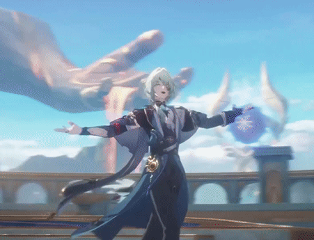

<!-- Kazuniverse's GitHub Profile README -->

<h1 align="center">Hi, I'm Kazuniverse 👋</h1>

  
  
  

---

## 👤 About Me

🎓 **Student** exploring the universe of technology and creativity  
🎮 **Game Developer** specializing in **C#**, **Shaders**, **Animation**, and **Design**  
🌐 **Web Developer** skilled in **HTML**, **CSS**, **JavaScript**, **PHP** and their frameworks  
🎨 **Designer & Illustrator** passionate about creating visually stunning experiences  
🗣️ **Public Speaker & Relations** – I love connecting with people and sharing ideas

---

## 🛠️ Skills

- **Game Development:**  
  `C#` | Shaders | Game Design | Animation | Unity | Creativity

- **Web Development:**  
  `HTML` | `CSS` | `JavaScript` | `PHP` | Responsive Design | Frameworks (React, Vue, Laravel, etc.)

- **Design & Animation:**  
  Illustration | UI/UX | 2D/3D Animation | Concept Art

- **Other:**  
  Public Speaking | Community Engagement | Team Collaboration

---

## 🎲 Favorite Projects

- **Game Creation & Design:**  
  I love developing games and bringing imaginative worlds to life through programming, design, and animation.

- **Web Experiences:**  
  Building interactive and beautiful websites is always exciting for me.

---

## ❤️ Passions

- Programming cool projects  
- Drawing illustrations  
- Animating stories and characters  
- Exploring new design styles  
- Sharing knowledge and connecting with others

---

## 🔗 Social Links

<!-- Add your social links here when you're ready! 
[Twitter](#) • [LinkedIn](#) • [Personal Website](#)
-->

---

## 💬 Favorite Quote

> "Reach for the hands of those you can reach, but sometimes there are things we can't reach even if we try many times."

---

  

---

  Thanks for stopping by! Let's create, code, and connect 🚀

